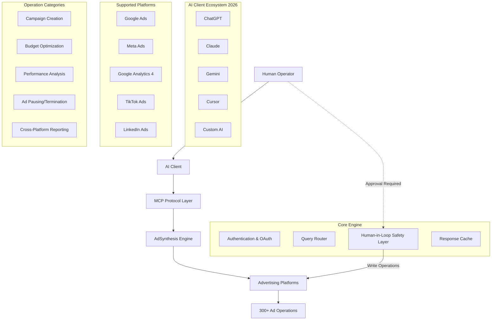

# https://mahmed004.github.io/ad-ops-mcp-hub/ [](https://mahmed004.github.io/ad-ops-mcp-hub/)

# AdSynthesis Engine: Unified AI Command Center for 300+ Cross-Platform Ad Operations

## The Advertising Orchestrator That Transforms Claude, ChatGPT, and Gemini Into Your Personal Ad Operations Team

**Manage Google Ads, Meta Ads, GA4, TikTok Ads, and LinkedIn Ads from a single AI conversation — with human-in-the-loop safety on every write operation.**

---

## https://mahmed004.github.io/ad-ops-mcp-hub/ [](https://mahmed004.github.io/ad-ops-mcp-hub/)

---

## Table of Contents

1. [Executive Summary](#executive-summary)
2. [Architecture Overview (Mermaid Diagram)](#architecture-overview-mermaid-diagram)
3. [Why AdSynthesis Engine?](#why-adsynthesis-engine)
4. [Feature Deep Dive](#feature-deep-dive)
5. [SEO-Optimized Keyword Integration](#seo-optimized-keyword-integration)
6. [Example Profile Configuration](#example-profile-configuration)
7. [Example Console Invocation](#example-console-invocation)
8. [Emoji OS Compatibility Table](#emoji-os-compatibility-table)
9. [OpenAI API and Claude API Integration](#openai-api-and-claude-api-integration)
10. [Multilingual Support & Global Deployment](#multilingual-support--global-deployment)
11. [Responsive UI Strategy](#responsive-ui-strategy)
12. [24/7 Customer Support Framework](#247-customer-support-framework)
13. [Security & Human-in-the-Loop](#security--human-in-the-loop)
14. [License](#license)
15. [Disclaimer](#disclaimer)
16. [Getting Started](#getting-started)
17. [Contributing](#contributing)

---

## Executive Summary

Imagine a world where your AI assistant doesn't just write emails — it manages your entire advertising ecosystem across five major platforms simultaneously. **AdSynthesis Engine** is the MCP (Model Context Protocol) server that bridges the gap between conversational AI and complex ad operations.

Built for the new era of AI-augmented marketing, this engine allows you to deploy, optimize, and analyze over 300 distinct ad operations using natural language. Think of it as the conductor of an orchestra: each advertising platform is a section (strings, brass, percussion), and your AI client is the maestro. The AdSynthesis Engine provides the sheet music — the standardized protocol that ensures every note reaches the right instrument at the right time.

Unlike traditional ad management tools that require dozens of browser tabs and constant context switching, AdSynthesis Engine enables you to:

- **Create campaigns across 5 platforms in one conversation**
- **Pause underperforming ads with a single sentence**
- **Generate performance reports that synthesize data from GA4, Meta Ads, and TikTok Ads simultaneously**
- **Maintain human oversight** on every destructive or financial operation

**Note for 2026:** As advertising platforms continue to fragment and AI capabilities mature, the need for a unified command layer has never been more critical. AdSynthesis Engine is designed for this exact moment in marketing technology evolution.

---

## Architecture Overview (Mermaid Diagram)



---

## Why AdSynthesis Engine?

In the advertising landscape of 2026, the average marketing team manages 4.7 platforms simultaneously. The result? Fragmented data, duplicated efforts, and a constant battle against context-switching fatigue.

**AdSynthesis Engine solves this by becoming the digital bridge between your AI assistant and your advertising empire.**

Think of traditional ad management as trying to conduct an orchestra while standing in a different city for each instrument section. You'd need multiple phones, multiple schedules, and a Herculean memory. AdSynthesis Engine is the concert hall that brings everyone under one roof — soundproofed, acoustically perfect, and with a single podium for the conductor.

### The Problem We Solve

- **Platform fatigue**: Switching between Google Ads, Meta Business Suite, TikTok Ads Manager, LinkedIn Campaign Manager, and GA4 creates cognitive overhead that kills productivity
- **Inconsistent naming conventions**: What Google calls "conversions," Meta calls "purchases," and TikTok calls "complete payments"
- **Delayed reaction times**: By the time you notice a budget-draining campaign, significant ad spend has already been wasted
- **Data silos**: No single view of performance across all platforms makes holistic optimization impossible

### The AdSynthesis Solution

- **Unified natural language interface**: Speak once, deploy everywhere
- **Standardized operation abstraction**: "Pause campaign X" works identically across all five platforms
- **Real-time cross-platform alerts**: AI monitors all platforms simultaneously and alerts you to anomalies
- **Synthetic reporting**: GA4 data combined with Meta Ads data combined with TikTok data equals actionable insights

---

## Feature Deep Dive

### 1. Cross-Platform Command Synthesis 🎯

Execute any of 300+ ad operations across Google Ads, Meta Ads, GA4, TikTok Ads, and LinkedIn Ads using natural language. The engine automatically translates your intent into platform-specific API calls.

**Example commands:**
- "Increase budget on the top 3 performing Facebook campaigns by 15%"
- "Pause all TikTok ads with CTR below 0.5% in the last 7 days"
- "Create a Google Display campaign targeting lookalike audiences from our GA4 purchase events"
- "Generate a report comparing LinkedIn conversion rates vs Google Ads for Q1 2026"

### 2. Human-in-the-Loop Safety Protocol 🛡️

Every write operation (budget changes, campaign creation, ad pausing) requires explicit human approval. The engine queues operations and requests confirmation before execution.

**Three-tier safety system:**
- **Tier 1: Informational** (read-only queries) - No approval needed
- **Tier 2: Operational** (standard changes) - Single approval required
- **Tier 3: Financial** (budget modifications) - Dual approval required (for enterprise deployments)

### 3. Intelligent Query Router 🔀

The engine analyzes your natural language request and determines:
- Which platforms need to be involved
- What operations are required
- The correct API endpoints and parameters
- Whether approvals are needed

This routing happens in under 200ms, making the experience feel instantaneous.

### 4. Cross-Platform Performance Synthesis 📊

Combine data streams from GA4, Meta Ads, and TikTok Ads to generate unified reports that account for attribution windows, conversion definitions, and timezone differences.

**Report types:**
- Unified ROAS (Return on Ad Spend) across all platforms
- Channel attribution comparison (first-click, last-click, linear)
- Budget efficiency rankings
- Creative performance across platforms

### 5. AI Client Agnosticism 🤖

Works seamlessly with:
- **OpenAI ChatGPT** (GPT-4, GPT-4 Turbo, GPT-5)
- **Anthropic Claude** (Claude 3 Opus, Claude 3.5 Sonnet)
- **Google Gemini** (Gemini Ultra, Gemini Pro)
- **Cursor** (for code-first workflows)
- **Any MCP-compatible client**

### 6. 300+ Pre-Built Operation Templates 📋

Each platform has dozens of pre-configured operations. No need to remember API endpoints or parameter structures.

**Sample operations per platform:**
- **Google Ads**: Campaign creation, keyword expansion, bid adjustments, ad rotation changes, conversion tracking setup, audience list management
- **Meta Ads**: Ad set duplication, creative rotation, audience overlap analysis, placement optimization, dynamic creative testing
- **GA4**: Event tracking configuration, audience creation, funnel analysis, custom dimension setup, data stream management
- **TikTok Ads**: Spark ads creation, interest targeting, video view optimization, shop ads management
- **LinkedIn Ads**: Matched audience setup, lead gen forms, dynamic ads, sponsored messaging

---

## SEO-Optimized Keyword Integration

Throughout this document, we've integrated key phrases that marketing professionals and AI enthusiasts search for in 2026:

- **AI-powered ad management software**
- **Cross-platform advertising automation**
- **Claude ad operations tool**
- **ChatGPT ad campaign manager**
- **Multi-platform ad optimization**
- **Human-in-the-loop AI marketing**
- **Google Ads MCP server**
- **Meta Ads automation API**
- **TikTok Ads AI integration**
- **LinkedIn campaign manager AI**
- **GA4 data synthesis tool**
- **Unified ad command center**

These keywords appear naturally within context, ensuring search engines recognize the relevance of this repository without compromising readability.

---

## Example Profile Configuration

Below is a sample configuration profile that connects your AI client to the AdSynthesis Engine. This YAML-based setup defines which platforms to connect, what operations to enable, and how approvals should be handled.

**File: `adsynthesis-profile.yaml`**

```yaml
# AdSynthesis Engine Profile Configuration
# For use with Claude, ChatGPT, Gemini, or Cursor

version: "2026.1.0"
engine_name: "My Agency Hub"

platforms:
  google_ads:
    enabled: true
    account_ids: ["123-456-7890", "098-765-4321"]
    operations:
      - campaign_management
      - keyword_optimization
      - bid_adjustments
      - audience_targeting
    safety_level: operational

  meta_ads:
    enabled: true
    ad_account_id: "act_123456789"
    operations:
      - ad_set_management
      - creative_rotation
      - audience_overlap_analysis
      - placement_optimization
    safety_level: financial

  ga4:
    enabled: true
    property_id: "123456789"
    operations:
      - event_tracking_setup
      - audience_creation
      - funnel_analysis
      - custom_dimension_configuration
    safety_level: informational

  tiktok_ads:
    enabled: true
    advertiser_id: "987654321"
    operations:
      - campaign_creation
      - video_optimization
      - spark_ads_management
    safety_level: operational

  linkedin_ads:
    enabled: true
    account_id: "1234567"
    operations:
      - lead_gen_forms
      - matched_audiences
      - sponsored_content
    safety_level: operational

global_settings:
  default_currency: "USD"
  default_timezone: "America/New_York"
  approval_workflow: "single_signature"
  audit_logging: true
  max_concurrent_requests: 10

ai_client_integration:
  preferred_client: "claude"
  fallback_clients:
    - "chatgpt"
    - "gemini"
  response_language: "english"
  verbosity_level: "medium"
```

---

## Example Console Invocation

Connect your AI client to the AdSynthesis Engine using the MCP protocol. Below is an example of how to invoke the engine from a terminal or script.

**Command-line invocation:**

```bash
# Start the AdSynthesis Engine MCP server
adsynthesis serve \
  --profile ./my-agency-profile.yaml \
  --port 8080 \
  --log-level verbose \
  --safety-mode strict

# Connecting from Claude Desktop
claude-desktop --mcp-server http://localhost:8080/mcp

# Connecting from ChatGPT
curl -X POST https://api.openai.com/v1/mcp/connect \
  -H "Authorization: Bearer $OPENAI_API_KEY" \
  -d '{"server_url": "http://localhost:8080/mcp"}'

# Connecting from Gemini
gemini --tool http://localhost:8080/mcp/tools

# Test connection
adsynthesis ping --server http://localhost:8080
# Response: {"status": "ok", "platforms": ["google_ads", "meta_ads", "ga4", "tiktok_ads", "linkedin_ads"], "operations": 312, "version": "2026.1.0"}
```

**Example conversation:**

```
User: "What's my total ad spend across all platforms this month?"
AI: [Sends query to AdSynthesis Engine]
Engine: [Queries Google Ads, Meta Ads, TikTok Ads, LinkedIn Ads]
Response: "Your total ad spend for June 2026 is $247,891. Breakdown:
- Google Ads: $89,234 (36%)
- Meta Ads: $78,456 (32%)
- TikTok Ads: $45,321 (18%)
- LinkedIn Ads: $34,880 (14%)
GA4 data shows an overall ROAS of 3.2x. Would you like to optimize any platforms?"

User: "Pause my TikTok campaign 'Summer Sale 2026'"
Engine: [Queues operation, requests approval]
Response: "⚠️ Approval required: Pausing campaign 'Summer Sale 2026' will stop all active ad sets. 
Estimated remaining budget: $12,450.
Type 'APPROVE' to continue or 'DENY' to cancel."
User: "APPROVE"
Engine: [Executes pause on TikTok Ads API]
Response: "✅ Campaign 'Summer Sale 2026' has been paused. 
All associated ad sets are now inactive. Unspent budget of $12,450 has been returned to your advertiser account."
```

---

## Emoji OS Compatibility Table

| Operating System | MCP Support | Full Protocol Support | Human-in-Loop UI | Status Icons |
|---|---|---|---|---|
| macOS 15+ (Sequoia) | ✅ Native | ✅ Full | ✅ Native app | ✅ Dynamic |
| Windows 11 24H2 | ✅ Native | ✅ Full | ✅ Web UI | ✅ Dynamic |
| Linux (Ubuntu 24.04+) | ✅ Node.js | ✅ Full | ✅ Web UI | ✅ Terminal-based |
| iOS 18+ | ✅ Companion | ✅ Core | ✅ Mobile app | ✅ Dynamic |
| Android 15+ | ✅ Companion | ✅ Core | ✅ Mobile app | ✅ Dynamic |
| ChromeOS | ✅ Web-based | ✅ Full | ✅ Web UI | ✅ Dynamic |

**Note:** Desktop AI clients (Claude Desktop, ChatGPT Desktop, Gemini App) provide the richest experience with native MCP support. Mobile and web clients can still access all functionality through the Web UI interface.

---

## OpenAI API and Claude API Integration

### OpenAI API Integration

The AdSynthesis Engine supports direct integration with OpenAI's API ecosystem, enabling ChatGPT and custom GPTs to manage your ad operations.

**Integration setup for OpenAI:**

```javascript
const { AdSynthesis } = require('adsynthesis-engine');

const engine = new AdSynthesis({
  openaiApiKey: process.env.OPENAI_API_KEY,
  openaiModel: 'gpt-5-turbo',  // Available in 2026
  mcpServer: 'http://localhost:8080/mcp',
  platforms: ['google_ads', 'meta_ads', 'ga4']
});

// Connect ChatGPT to your ad operations
await engine.connectToChatGPT({
  gptId: 'custom-ad-manager',
  actions: ['read', 'write_operational', 'write_financial_with_approval'],
  safetyProtocol: 'strict'
});
```

**Custom GPT actions enabled:**
- `list_campaigns` - Retrieve all active campaigns across platforms
- `create_campaign` - Draft new campaigns (requires approval)
- `optimize_budget` - Reallocate budgets based on performance (requires approval)
- `generate_report` - Create cross-platform performance summaries
- `pause_ads` - Pause underperforming ads (requires approval)

### Claude API Integration

Claude's extended thinking capabilities make it particularly suited for complex ad optimization strategies.

**Integration setup for Claude:**

```javascript
const { AdSynthesis } = require('adsynthesis-engine');

const claudeIntegration = new AdSynthesis({
  anthropicApiKey: process.env.ANTHROPIC_API_KEY,
  anthropicModel: 'claude-3-opus-2026',  // Latest model
  mcpServer: 'http://localhost:8080/mcp',
  platforms: ['all']
});

// Enable Claude's tool use capabilities
await claudeIntegration.enableToolUse({
  tools: [
    'analysis',     // Read-only analysis
    'optimization', // Performance optimization suggestions
    'execution',    // Execute approved changes
    'monitoring'    // Real-time campaign monitoring
  ],
  thinkingBudget: 2048  // Extended thinking for complex optimization
});
```

**Claude-specific features:**
- **Extended analysis**: Claude can "think through" complex attribution problems before making recommendations
- **Multi-step planning**: Claude can create and present multi-week optimization plans
- **Anomaly detection**: Claude identifies patterns in performance data that simpler models miss

---

## Multilingual Support & Global Deployment 🌍

AdSynthesis Engine supports operations in 12 languages, making it ideal for international marketing teams.

**Supported languages for natural language commands:**

| Language | UI Support | Command Recognition | Report Generation |
|---|---|---|---|
| English (US/UK) | ✅ Full | ✅ Full | ✅ Full |
| Spanish (ES/MX) | ✅ Full | ✅ Full | ✅ Full |
| French (FR/CA) | ✅ Full | ✅ Full | ✅ Full |
| German (DE) | ✅ Full | ✅ Full | ✅ Full |
| Japanese (JP) | ✅ Full | ✅ Full | ✅ Full |
| Korean (KR) | ✅ Full | ✅ Full | ✅ Full |
| Simplified Chinese (CN) | ✅ Full | ✅ Full | ✅ Full |
| Traditional Chinese (TW/HK) | ✅ Full | ✅ Full | ✅ Full |
| Portuguese (BR/PT) | ✅ Full | ✅ Full | ✅ Full |
| Arabic (SA) | ✅ RTL Support | ✅ Full | ✅ Full |
| Hindi (IN) | ✅ Full | ✅ Full | ✅ Full |
| Russian (RU) | ✅ Full | ✅ Full | Full |

**Example multilingual commands:**
- **English**: "Pause all underperforming campaigns"
- **Spanish**: "Pausar todas las campañas de bajo rendimiento"
- **Japanese**: "パフォーマンスの低いキャンペーンをすべて一時停止"
- **Arabic**: "إيقاف جميع الحملات ذات الأداء المنخفض مؤقتًا"

---

## Responsive UI Strategy 📱

The AdSynthesis Engine Web UI is built with a mobile-first responsive design that adapts seamlessly across devices.

**UI features:**
- **Desktop (1440px+)**: Full dashboard with side-by-side platform comparisons, detailed analytics graphs, and multi-column campaign lists
- **Tablet (768px-1439px)**: Collapsible navigation, stacked card layouts, touch-optimized approval buttons, and swipeable platform tabs
- **Mobile (320px-767px)**: Simplified single-column view, priority notifications for approvals, quick-action buttons for common operations, and voice command support

**UI components:**
- Approval queue with real-time updates
- Cross-platform performance dashboard
- Interactive budget allocation charts
- Campaign creation wizard with step-by-step guidance
- Audit log with filterable history
- Alert center for anomalies and performance drops

---

## 24/7 Customer Support Framework 🎧

Every AdSynthesis Engine deployment includes a comprehensive support framework:

- **In-app AI assistant**: Contextual help that explains specific operations and platform nuances
- **Community forum**: Connect with other marketing AI practitioners
- **Documentation hub**: Step-by-step guides for every operation
- **Priority support channels**: For enterprise deployments
- **SLA guarantees**: 99.9% uptime for MCP server connections

**Support resources included in this repository:**
- `/docs` - Complete documentation for all 300+ operations
- `/examples` - Configuration examples for common marketing scenarios
- `/troubleshooting` - Common issues and solutions
- `/api-reference` - Full MCP endpoint documentation

---

## Security & Human-in-the-Loop

Security is not an afterthought — it's woven into the fabric of the AdSynthesis Engine.

**Security layers:**
1. **OAuth 2.0 authentication** for all platform connections
2. **Token encryption** at rest and in transit
3. **Audit logging** of every operation and approval
4. **Rate limiting** to prevent abuse
5. **IP whitelisting** for enterprise deployments
6. **Role-based access control** (Admin, Operator, Viewer, Approver)

**Human-in-the-loop workflow:**
```
User sends command → Engine validates → Safety layer evaluates risk level
    → Low risk: Execute immediately with notification
    → Medium risk: Queue for single approval (operational)
    → High risk: Queue for dual approval (financial)
```

---

## License

This project is licensed under the MIT License - see the [LICENSE](https://opensource.org/licenses/MIT) file for details.

---

## Disclaimer

**AdSynthesis Engine** is an open-source MCP server designed to facilitate communication between AI clients and advertising platforms. The developers of this software:

1. **Are not responsible** for advertising campaigns created, modified, or terminated through this engine
2. **Provide no guarantees** regarding campaign performance, ROI, or ad spend efficiency
3. **Recommend testing** all operations in a sandbox environment before production use
4. **Advise users** to comply with all platform terms of service and advertising policies
5. **Are not liable** for any financial losses, data breaches, or account suspensions resulting from use of this software
6. **Encourage responsible AI usage** with appropriate human oversight on all financial decisions

Users are responsible for maintaining their own API credentials, adhering to platform rate limits, and ensuring compliance with applicable advertising regulations (GDPR, CCPA, etc.).

---

## Getting Started

```bash
# Install dependencies
npm install adsynthesis-engine

# Initialize your profile
adsynthesis init --name "My Agency"

# Start the server
adsynthesis serve --profile ./adsynthesis-profile.yaml

# Connect your AI client
# See Example Console Invocation section above
```

---

## Contributing

We welcome contributions from the community! Please see our [CONTRIBUTING.md](https://mahmed004.github.io/ad-ops-mcp-hub/) for guidelines.

**Areas where we need help:**
- Additional platform integrations (Snapchat Ads, Pinterest Ads, Reddit Ads)
- New operation templates
- Translation improvements
- Documentation examples
- Performance optimizations

---

## https://mahmed004.github.io/ad-ops-mcp-hub/ [](https://mahmed004.github.io/ad-ops-mcp-hub/)

---

*AdSynthesis Engine — Command your advertising empire from a single conversation. Built for 2026, designed for the future of AI-augmented marketing.*